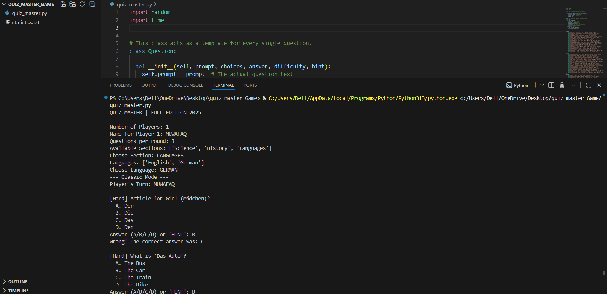
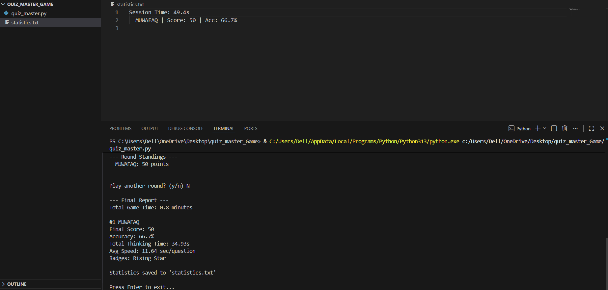

# Quiz Master

A Python-based interactive multiplayer quiz engine covering multiple
subjects (Science, History, English, German), with scoring, hints,
achievement badges, and automated end-of-session reporting.

## Screenshots




## Features
- Question bank organized by subject, with nested sub-categories (e.g.
  Languages -> English / German)
- Multiplayer support: each player gets a uniquely randomized question set
- Difficulty-weighted scoring (Easy = 10, Medium = 20, Hard = 30)
- Hint system: revealing a hint halves the potential score for that question
- Achievement badges ("Fast Thinker" for sub-3-second answers, "Rising Star"
  for 50+ points), with duplicate-prevention logic
- Automatic end-of-game report: per-player score, accuracy %, average
  response time, and badges earned, saved to `statistics.txt`
- Input validation and error handling throughout (via `try/except` and
  input-loop guards) to prevent crashes on invalid input

## How to run
```bash
python quiz_master.py
```
Follow the prompts to set the number of players, player names, and
questions per round. Type `HINT` instead of an answer letter to reveal a
hint (at the cost of half the question's points).

## Design notes
- `Question` and `Player` are implemented as classes to encapsulate related
  data (prompt/choices/answer/difficulty/hint; name/score/history) instead
  of using scattered loose variables.
- The question database is a nested dictionary, allowing flat categories
  (Science, History) and nested categories (Languages -> English/German) to
  coexist under the same lookup structure.
- `random.sample()` ensures each player receives a fresh, non-repeating
  question set per round even within the same session.

## Stack
Python 3 (standard library only — `random`, `time`; no external dependencies)
